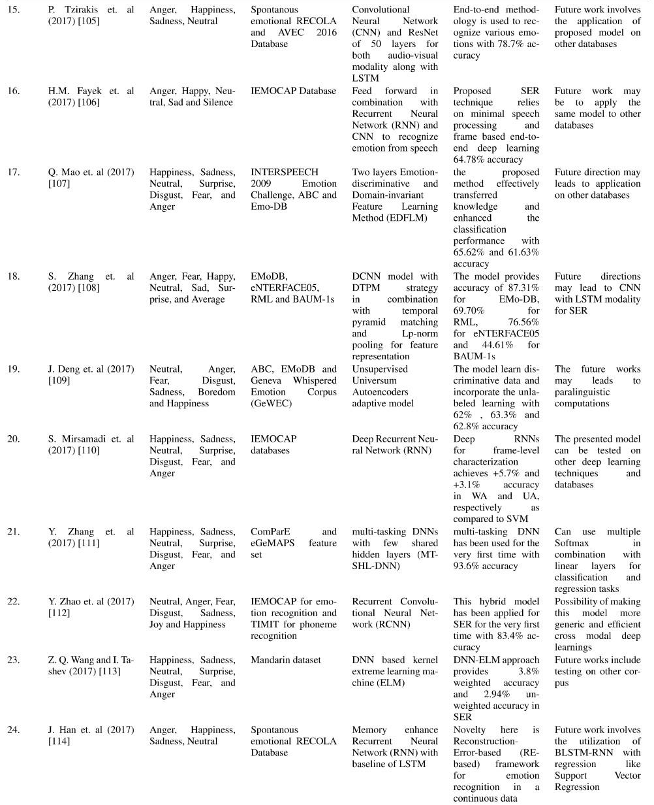

# Language-Independent-Speech-Emotion-Recognition-using-MFCCs

LIVE PROJECT: https://krishnaone-speech-emotion-recognition-using-mfccs-app2-d4oz1s.streamlit.app/

NOTE: Recording feature is not working yet.

[Speech Emotion Recognition (SER)](https://krishnaone-speech-emotion-recognition-using-mfccs-app2-d4oz1s.streamlit.app/) is the act of identifying the emotional aspects of speech independently of its semantic content. Humans can perform this task effectively as a natural part of voice communication, but the ability to do so automatically using programmable devices is still a subject of ongoing research. Speech Emotion Recognition (SER) is a system that can identify the emotion of different audio samples. Like sentiment analysis, you can use speech emotion recognition to find the emotional range or sentimental value in various audio recordings such as job interviews, caller-agent calls, streaming videos, and songs. As of now, numerous specialists have fostered a different methodologies around here for SER from over the course of the last 10 years. Typically, SER pipeline is divided into two main parts: feature selection and classification. The method of selecting and classifying the discriminating characteristics that correctly identify the speaker's emotional state is a challenging task in this field. Researchers apply deep learning techniques for SER, using the Mel scale filter bank speech spectrogram as an input function. A spectrogram is a two-dimensional representation of speech signals, widely used in convolutional neural networks (CNN) to extract salient and distinctive features. Similarly, transitional learning strategies of SER can be utilized with speech spectrograms run through pre-trained CNN models such as VGG, DenseNet and Alex-Net. An important feature of SER can also be the Mel frequency cepstral coefficients. It represents the short-term power spectrum of sound by transforming the audio signal. The Mel scale is important because it brings human perception of sound closer to linear scales. In the filter source theory, "the source is the vocal cords and the filter represents the audio device." The length and shape of the vocal tract determine how sound is emitted by humans, and the sepstrom can describe the filter.

## Acknowledgement

I am deeply indebted to our project and training supervisor [Dr. Arvind Kumar](https://www.linkedin.com/in/dr-arvind-kumar-05a14136/), Associate Professor, Department of CSE, SRM University, Delhi-NCR. His scholarly guidance, important suggestions, endless patience, constant supervision, valuable criticism and enormous amount of work for going through our drafts and correcting them and generating courage from the beginning to the end of research work has made the completion of the project possible.

## Introduction

Research on automatic emotion recognition systems aims to develop efficient, real-time methods for emotion recognition in mobile phone users, call center operators and customers, car drivers, pilots, and many other users of human-machine communication. Adding emotions to machines is considered a key factor in making machines look and behave like humans. Robots that understand emotions can provide appropriate emotional responses and display emotional personalities. Under certain circumstances, humans can be replaced by computer-generated characters capable of very natural and persuasive conversations by appealing to human emotions. In machine learning, functional parameters are calculated from raw data (e.g. speech, video,). The function is used to train a model that learns to produce the desired output label. A common problem with this approach is feature selection. In general, it is not known which characteristics can lead to the most efficient grouping of data into different categories. Some insight can be gained by testing different features, combining multiple features into a common feature vector, or using different feature selection techniques. The quality of manually created features can have a significant impact on classification performance.

## Different Datasets Available

This SER System have used only Open Source Datasets. 
- `Crowd-sourced Emotional Mutimodal Actors Dataset (Crema-D)`
- `Ryerson Audio-Visual Database of Emotional Speech and Song (Ravdess)`
- `Surrey Audio-Visual Expressed Emotion (Savee)` 
- `Toronto emotional speech set (Tess)`

    

Some Additional Datasets used for performing EDA are:
1) https://github.com/soerenab/AudioMNIST
2) https://groups.csail.mit.edu/sls/downloads/flickraudio/downloads/flickr_audio.tar.gz 
3) https://keithito.com/LJ-Speech-Dataset/
4) https://github.com/microsoft/MS-SNSD
5) https://www.kaggle.com/datasets/rtatman/speech-accent-archive/versions/1

## Exploratory Data Analysis of Datasets

Discovery data analysis is the critical process of conducting preliminary investigations of data to discover patterns, detect anomalies, test hypotheses, and validate assumptions using summary statistics and graphical representations.
EDA is all about making sense of raw data.

    

## Result of Combining Datasets

    

## Convolutional Neural Network(CNN)

The construction of a convolutional neural network is a multi-layered feed-forward neural network, made by assembling many unseen layers on top of each other in a particular order. It is the sequential design that give permission to CNN to learn hierarchical attributes. In CNN, some of them followed by grouping layers and hidden layers are typically convolutional layers followed by activation layers. The pre-processing needed in a ConvNet is kindred to that of the related pattern of neurons in the human brain and was motivated by the organization of the Visual Cortex.

    

## Baseline CNN model for MFCCs

MFCCS stands for mel- frequency cepstrum coefficients. 

    

## Formulae of Cepstrum

    

Basically, it converts a sound wave into an absolute form and generates a logarithm, which you can use to determine a signal's frequency and magnitude, and also examine periodicities and general trends. Finally, we performed an inverse transform to get the general spectrum of the signal (Quefrency VS Magnitude).

Speech = Convolution of vocal tract frequency response and Glottal pulse.
We are mostly interested in the Vocal tract, which contains the main knowledge that helps us understand our data (formants), and therefore we're looking for a way to seperate the Vocal tract from the Speech wave without having the Glottal pulse as well. We do that by applying a logarithm on the amplitude (audio is perceived logarithmically and not linearly),mel-scaling, and then a transformation (Discrete cosine transform).

Our result - the waves coefficients (MFCCS)

## Workflow of MFCCs

    

## Our Approach to Speech Emotion Recognition

The speech emotion recognition pipeline was built the following way :

- `1) Voice recording`

- `2) Audio signal discretization`

- `3) Log-mel-spectrogram extraction`

- `4) Split spectrogram using a rolling window`

- `5) Make a prediction using our pre-trained model`

The first term we’re going to talk about is the Sound Wave. Sound could be defined as a mechanical disturbance that propagates through an elastic material medium, such as air. It propagates in longitudinal waves (hence the term ‘Sound Waves’) and consists of alternating compressions and rarefactions, or regions of high pressure and low pressure, moving at a certain speed. The way our bodies able to create Sound Waves originates in our Glottal Pulse, which manipulates the folds of our vocal cords when we’re speaking. That is obviously very helpful for generating sounds but wouldn’t be enough to actually make sense of them, let alone communicate with each other. To accomplish that, we have our Vocal Tract.

The Vocal Tract is a term that describes a system of different organs in our mouth and throat- Nasal cavity, the tip of the tongue, teeth, soft palate and more. The goal of this system is to serve as a filter to our Glottal Pulse in a way that makes sense of the different sounds we’re generating. To make things easier, we can say that our speech is a result of the different movements and manipulations we’re applying on our Glottal Pulse using our Vocal Tract.

We have categorized Audios on 7 parameters as shown below:

    

## Comparision of Research Papers on Speech Emotion Recognition

    

    

    

    

[IEEE September 4, 2019] R. A. Khalil et al.: SER Using Deep Learning Techniques: A Review

